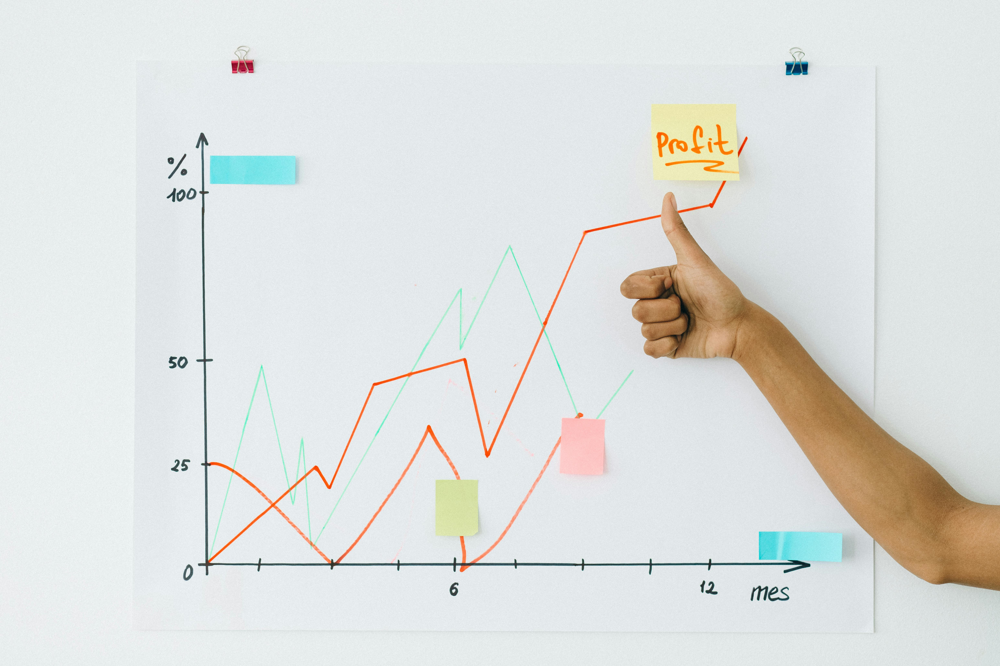

---
title: "Othmane Elouardi"
page-layout: full
format:
  html:
    toc: false
---

::: {#home .hero}
**Business Analytics • Strategy • Data-Driven Decisions**

# Othmane <span class="accent">Elouardi</span>

<span id="typewriter"></span><span class="cursor">|</span>

<div class="cta">
  <a class="btn btn-primary" href="#projects">View Projects</a>
  <a class="btn btn-outline" href="cv.pdf" download>Download CV</a>
  <a class="btn btn-ghost" href="#contact">Contact</a>
</div>

<div class="bg-orbs"></div>
:::

::: {#about .band .band--glass}

### About Me

Results-driven **Business Analyst** with a strong foundation in **Applied Business Analytics**, **data strategy**, and **process optimization**.  
My passion lies in transforming complex data into actionable insights that drive efficiency, growth, and measurable business outcomes.

Specialization in connecting data with strategic decision-making — blending technical tools with business acumen to improve performance across operations, forecasting, and reporting. My approach combines **data interpretation**, **problem-solving**, and **cross-functional collaboration** to deliver solutions that enhance productivity and organizational clarity.

Proficient in **Python**, **R**, **SQL**, **Tableau**, **Power BI**, and **Excel**, applying these tools to create analytical dashboards, optimize workflows, and support executive decision-making.  
Bringing a unique mix of analytical depth, strategic thinking, and leadership developed through both academic training and hands-on management experience.

{.headshot width=160}

[LinkedIn](https://www.linkedin.com/in/eothmane/){target=_blank} ·
[GitHub](https://github.com/Othmane-Elouardi){target=_blank} ·
<a href="cv.pdf" download>Download CV</a>

<hr class="subdivider">

### Professional Experience

**Assistant Department Manager — Willy Street Co-op, Madison, WI (2019 – Present)**  
As a key operational leader, I’ve integrated **data analytics** and **strategic process improvement** into daily operations, enabling more efficient service delivery and informed decision-making.

- Designed and implemented **data-informed initiatives** to optimize inventory, staffing, and service performance.  
- Utilized analytics tools to identify operational inefficiencies, forecast demand, and track performance metrics.  
- Collaborated across departments to develop KPI dashboards and streamline reporting workflows.  
- Led staff training and development focused on measurable outcomes, resulting in improved retention and productivity.  
- Supported business growth by combining **quantitative insights** with customer-centric strategies to enhance profitability.

<p class="muted small">
My role bridges analytics, leadership, and operational strategy — ensuring business intelligence directly supports daily execution and long-term performance.
</p>

<hr class="subdivider">

### Education

**M.S., Applied Business Analytics** — Boston University (MET)  
**Technical Diploma, Business Management** — Madison College  
**M.A., Communication in Contexts: Culture & Dialogue** — University Moulay Ismail  
**B.A., English Studies** — University Sidi Mohamed Ben Abdellah


::: {#skills .band .band--grid}
### Core Skills (Expandable)

<details open>
  <summary><strong>Analytics & Decision Support</strong></summary>
  <ul>
    <li>Advanced data analysis using Python (pandas, NumPy, scikit-learn) and R for business intelligence and forecasting</li>
    <li>Executive reporting and visualization using Power BI, Tableau, and Excel for KPI tracking and performance insights</li>
    <li>Statistical modeling, forecasting, and scenario simulation to support data-driven strategic planning</li>
    <li>Data cleaning, transformation, and validation for accurate and actionable insights</li>
    <li>Building automated reporting systems that streamline decision-making across business functions</li>
  </ul>
</details>

<details>
  <summary><strong>Operations & Optimization</strong></summary>
  <ul>
    <li>Process improvement and efficiency analysis through workflow automation and operational dashboards</li>
    <li>Data-driven resource allocation and inventory forecasting to reduce waste and improve service levels</li>
    <li>Cross-functional collaboration to identify performance gaps and design data-backed solutions</li>
    <li>Implementation of continuous improvement frameworks using Lean and Six Sigma methodologies</li>
    <li>Operational KPI development and performance tracking to align business outcomes with strategic objectives</li>
  </ul>
</details>

<details>
  <summary><strong>Tools & Methods</strong></summary>
  <ul>
    <li>Languages: Python, R, SQL</li>
    <li>Visualization: Power BI, Tableau, Excel (PivotTables, Power Query)</li>
    <li>Data Management: MySQL, PostgreSQL, Excel, CSV, and API-based data pipelines</li>
    <li>Analytics Techniques: Regression, Clustering, Time-Series Forecasting, Hypothesis Testing</li>
    <li>Project Tools: Git/GitHub, Quarto, Jupyter, VS Code</li>
    <li>Cloud & Automation: AWS EC2, Google Sheets integration, data workflow automation</li>
  </ul>
</details>

<details>
  <summary><strong>Business Strategy & Communication</strong></summary>
  <ul>
    <li>Translating complex data into clear narratives for executives and stakeholders</li>
    <li>Bridging technical and non-technical teams to align insights with organizational goals</li>
    <li>Developing business cases using data-driven evidence to support strategic initiatives</li>
    <li>Creating compelling visualizations and dashboards to tell the story behind the numbers</li>
    <li>Strong communication and presentation skills developed through leadership and training roles</li>
  </ul>
</details>
 


::: {#projects .band .band--dark}
<h2 class="text-center">Projects</h2>
<p class="muted text-center">My independent projects & contributions</p>

```{=html}
<!-- Project 1: AI vs Non-AI Career Analytics -->
<div class="project">
  
  <div class="project-info">
    <h3>AI vs Non-AI Career Analytics</h3>
    <p>
      A comprehensive <strong>data analytics project</strong> comparing global labor-market trends between AI-driven and non-AI careers. 
      The analysis integrates <strong>public labor statistics, salary benchmarks, and job-growth indicators</strong> to evaluate how emerging technologies reshape workforce demand. 
      Leveraged <strong>Python, Excel, and Power BI</strong> for data cleaning, exploratory analysis, and visualization to identify 
      <strong>correlations between automation, wage dispersion, and career sustainability</strong>. 
      Findings support <strong>strategic workforce planning and educational policy decisions</strong> through quantifiable evidence.
    </p>
    <a href="https://github.com/amoghc12/ai-vs-nonai-careers" target="_blank" class="btn btn-primary">View Project</a>
  </div>
</div>

<!-- Project 2: Business Simulation -->
<div class="project">
  
  <div class="project-info">
    <h3>Business Simulation</h3>
    <p>
      A multi-functional <strong>business analytics simulation</strong> enabling participants to manage a virtual organization across 
      <strong>operations, finance, marketing, and supply-chain management</strong>. 
      Applied <strong>scenario modeling and KPI tracking</strong> to assess profitability, operational efficiency, and long-term growth. 
      Utilized <strong>forecasting, demand planning, and data-driven decision frameworks</strong> to demonstrate how analytical insight guides 
      <strong>executive strategy and sustainable business development</strong>.
    </p>
    <a href="#" class="btn btn-primary">View Project</a>
  </div>
</div>

<!-- Project 3: Fundraiser Project Management -->
<div class="project">
  
  <div class="project-info">
    <h3>Fundraiser Project Management</h3>
    <p>
      A structured <strong>project-management and analytics case study</strong> following the complete <strong>project lifecycle</strong>—from concept and stakeholder planning 
      through execution, monitoring, and closure. 
      Emphasized <strong>risk analysis, resource optimization, and performance measurement</strong>, integrating 
      <strong>Gantt scheduling and cost-variance analytics</strong> to improve project predictability. 
      Showcased the role of <strong>data-informed leadership</strong> in coordinating teams, mitigating uncertainties, 
      and ensuring successful outcomes within budget and timeline.
    </p>
    <a href="#" class="btn btn-primary">View Project</a>
  </div>
</div>

<!-- Project 4: Quantitative Research Dissertation -->
<div class="project">
  
  <div class="project-info">
    <h3>Quantitative Research Dissertation</h3>
    <p>
      An empirical <strong>quantitative study</strong> grounded in <strong>survey design, statistical inference, and hypothesis testing</strong>. 
      Utilized <strong>R and SPSS</strong> for reliability assessment, regression modeling, and factor analysis to validate conceptual relationships within the research framework. 
      The project demonstrates advanced ability to <strong>translate theoretical constructs into measurable variables</strong> and to communicate findings 
      through statistically sound interpretation and visualization.
    </p>
    <a href="#" class="btn btn-primary">View Project</a>
  </div>
</div>

<style>
  /* High-contrast, readable text on dark bg */
  .project-info h3 { margin: 0 0 .4rem; color: #E9EEFB; font-weight: 800; }
  .project-info p  { margin: 0 0 .8rem; color: #CFE3FF; line-height: 1.6; font-size: 1.02rem; }

  /* Card layout */
  .project {
    display: flex;
    gap: 1.25rem;
    background: linear-gradient(180deg, rgba(255,255,255,.05), rgba(255,255,255,.02));
    border: 1px solid rgba(255,255,255,.10);
    border-radius: 16px;
    padding: 1.2rem;
    margin: 1rem 0;
    align-items: center;
  }
  .project-img {
    width: 340px;
    max-width: 100%;
    border-radius: 12px;
    display: block;
    flex-shrink: 0;
    box-shadow: 0 10px 30px rgba(0,0,0,.25);
    border: 1px solid rgba(255,255,255,.10);
  }

  /* Buttons */
  .btn.btn-primary {
    background-color: #74C0FF; color: #08101f; padding: .6rem 1rem;
    border-radius: 999px; font-weight: 700; text-decoration: none; display: inline-block;
  }
  .btn.btn-primary:hover { background-color: #95D0FF; }

  /* Mobile: stack vertical */
  @media (max-width: 980px) {
    .project { flex-direction: column; text-align: left; }
    .project-img { width: 100%; }
  }
</style>
```
:::


::: {#contact .band .band--accent}
<div class="section">
<h3>Contact Me</h3>
<p>Use this form to reach me — it goes directly to my inbox.</p>

```{=html}
<form id="contact-form" class="contact-form" autocomplete="on" novalidate>
  <!-- stacked, always -->
  <input type="text"  name="first_name" placeholder="First name" required>
  <input type="text"  name="last_name"  placeholder="Last name" required>
  <input type="email" name="_replyto"   placeholder="Your email" required inputmode="email" autocomplete="email">
  <input type="text"  name="company"    placeholder="Company (optional)" autocomplete="organization">
  <textarea name="message" rows="4" placeholder="Write your message..." required></textarea>

  <!-- Honeypot -->
  <input type="text" name="_gotcha" tabindex="-1" autocomplete="off" style="position:absolute;left:-9999px">

  <button type="submit" class="btn btn-primary" id="contact-submit">Send Message</button>
  <p id="form-status" class="muted" style="margin-top:.5rem;"></p>
</form>
</div> 
::: 

<!-- Wrangler / Cloudflare Worker notes:
  wrangler.toml
    [vars]
    ALLOWED_ORIGIN = "https://othmane-elouardi.github.io"
    FROM_EMAIL     = "website.onboarding@resend.dev"
    TO_EMAIL       = "othmaneelouardi@gmail.com"
  worker.js accepts JSON POST.
-->
:::

```{=html}
<style>
.subdivider{
  border:0;height:1px;margin:1.25rem 0 1rem;
  background:linear-gradient(90deg, rgba(255,255,255,.06), transparent);
}
</style>

<script>
// ---------- Typewriter ----------
const phrases=["Turning data into decisions","Optimizing operations with analytics","Driving measurable business impact"];
let i=0,j=0,del=false,el=document.getElementById("typewriter");
function tick(){const full=phrases[i]; j+=del?-1:1; el.textContent=full.slice(0,j);
  if(!del&&j===full.length){del=true; setTimeout(tick,1100); return;}
  if(del&&j===0){del=false; i=(i+1)%phrases.length;}
  setTimeout(tick, del?45:70);
}
tick();

// ---------- Reveal on scroll ----------
const io=new IntersectionObserver(es=>es.forEach(e=>{if(e.isIntersecting)e.target.classList.add('reveal')}),{threshold:.12});
document.querySelectorAll('.section,.card').forEach(n=>io.observe(n));


// ---------- Scroll spy (middle-of-screen guideline, stable) ----------
(() => {
  const HEADER_OFFSET = 80;       // your sticky header height
  const CENTER_RATIO  = 0.50;     // 0.50 = exact middle; try 0.45 if you want a bit above center

  const sections = [...document.querySelectorAll('.band[id], .hero[id], .section[id]')];
  const navLinks = [...document.querySelectorAll('.navbar a[href*="#"], .navbar .nav-link[href*="#"]')];

  function setActive(id){
    navLinks.forEach(a => {
      const href = a.getAttribute('href') || '';
      a.classList.toggle('active', href.endsWith('#' + id));
    });
    document.querySelectorAll('.band, .section').forEach(b => b.classList.remove('current'));
    const el = document.getElementById(id);
    if (el && (el.classList.contains('band') || el.classList.contains('section'))) {
      el.classList.add('current');
    }
  }

  // Cache absolute Y positions of section tops
  let positions = [];
  function computePositions(){
    positions = sections
      .map(s => ({ id: s.id, top: s.getBoundingClientRect().top + window.scrollY }))
      .sort((a,b) => a.top - b.top);
  }

  function updateActive(){
    // Guideline is around the middle of the viewport, plus header offset
    const guideY = window.scrollY + HEADER_OFFSET + window.innerHeight * CENTER_RATIO;

    // Pick the last section whose top is <= guideY
    let current = positions[0];
    for (const p of positions){
      if (p.top <= guideY) current = p; else break;
    }

    // If scrolled to the very bottom, force last section
    if (window.innerHeight + window.scrollY >= document.body.scrollHeight - 2) {
      current = positions[positions.length - 1];
    }

    if (current){
      setActive(current.id);
      if (!location.hash.endsWith('#' + current.id)) {
        history.replaceState(null, '', '#' + current.id);
      }
    }
  }

  // Recompute on load/resize (in case content height changes)
  function recomputeAndUpdate(){
    computePositions();
    updateActive();
  }

  window.addEventListener('load',  recomputeAndUpdate);
  window.addEventListener('resize', recomputeAndUpdate);

  // Smooth, throttled scroll handling
  let ticking = false;
  window.addEventListener('scroll', () => {
    if (!ticking){
      ticking = true;
      requestAnimationFrame(() => { updateActive(); ticking = false; });
    }
  }, { passive: true });

  // Initial run
  recomputeAndUpdate();
})();


// ---------- Force download on navbar "CV" ----------
const navCv = document.querySelector('.navbar a[href$="cv.pdf"], .navbar .nav-link[href$="cv.pdf"]');
if (navCv) { navCv.setAttribute('download',''); }

// ---------- Cloudflare Worker AJAX (JSON) ----------
const form = document.getElementById('contact-form');
const statusEl = document.getElementById('form-status');

// Use your deployed Workers URL:
const CONTACT_ENDPOINT = 'https://contact-endpoint.othmaneelouardi.workers.dev';

form.addEventListener('submit', async (e) => {
  e.preventDefault();
  statusEl.textContent = 'Sending...';

  // Honeypot
  const bot = (form.querySelector('[name="_gotcha"]') || {}).value || '';
  if (bot) { statusEl.textContent = 'Thanks!'; form.reset(); return; }

  // Build payload (Worker expects email + message; we also send a combined name)
  const data = Object.fromEntries(new FormData(form).entries());
  data.name = `${data.first_name || ''} ${data.last_name || ''}`.trim();

  try {
    const resp = await fetch(CONTACT_ENDPOINT, {
      method: 'POST',
      headers: { 'Content-Type': 'application/json', 'Accept': 'application/json' },
      body: JSON.stringify(data)
    });

    if (resp.ok) {
      form.reset();
      statusEl.textContent = 'Thanks! Your message has been sent.';
    } else {
      const err = await resp.text().catch(() => '');
      console.warn('Contact form error', resp.status, err);
      statusEl.textContent = 'Something went wrong. Please try again.';
    }
  } catch (err) {
    console.warn('Contact form network error', err);
    statusEl.textContent = 'Network error. Please try again.';
  }
});


</script>